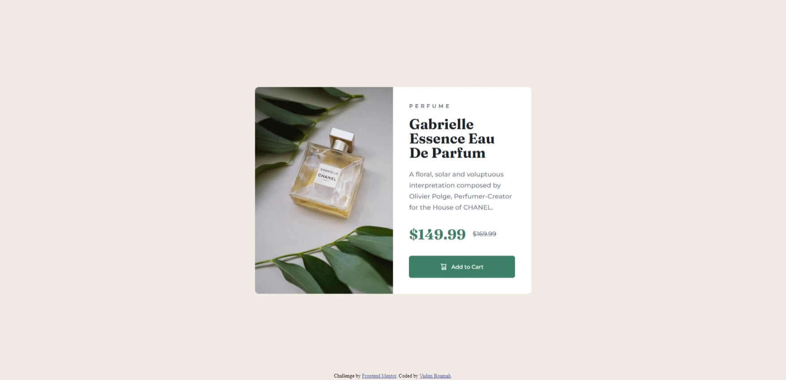
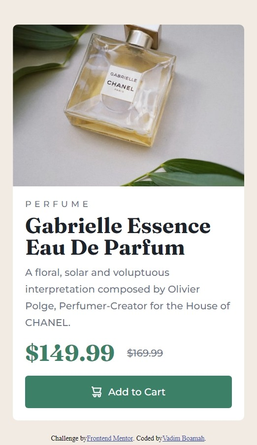

# Frontend Mentor - Product preview card component solution

This is a solution to the [Product preview card component challenge on Frontend Mentor](https://www.frontendmentor.io/challenges/product-preview-card-component-GO7UmttRfa). Frontend Mentor challenges help you improve your coding skills by building realistic projects. 

## Table of contents

- [Overview](#overview)
  - [The challenge](#the-challenge)
  - [Screenshot](#screenshot)
  - [Links](#links)
- [My process](#my-process)
  - [Built with](#built-with)
  - [What I learned](#what-i-learned)
  - [Continued development](#continued-development)
  - [Useful resources](#useful-resources)
- [Author](#author)

## Overview

### The challenge

Users should be able to:

- View the optimal layout depending on their device's screen size
- See hover and focus states for interactive elements

### Screenshot

### Links

- Solution URL: [Click to see solution](https://github.com/Wytecloud/Frontend-mentor-design)
- Live Site URL: [Visit site](https://wytecloud.github.io/Frontend-mentor-design/)

## My process

### Built with

- Semantic HTML5 markup
- CSS custom properties
- Flexbox
- Desktop-first workflow
- [Montserrat](https://fonts.google.com/specimen/Montserrat)
- [Fraunces](https://fonts.google.com/specimen/Fraunces)

### What I learned

Planning out the HTML first helps out a lot in the long run, and speeds up the work flow, with the ease of finding any errors.

Flexbox is my friend.

### Continued development

I am aim to be able to implement responsive designs in all future works and push myself to having my designs be beautifully viewed no matter the device.

### Useful resources

- [Kevin Powell](https://www.youtube.com/watch?v=u044iM9xsWU) - King of CSS is a must to grasp any CSS fundementals, really helped with flexbox properties.

## Author

- Website - [Vadim Boamah](https://www.your-site.com)
- Frontend Mentor - [@Wytecloud](https://www.frontendmentor.io/profile/Wytecloud)
- Twitter - [@Wytecloud](https://twitter.com/Wytecloud)
